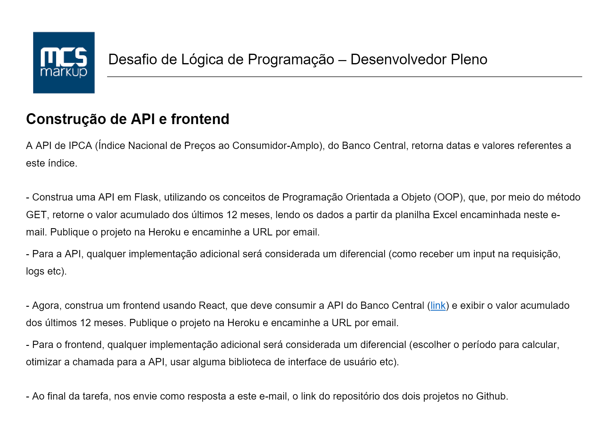

## P.S. p/ Desenvolvedor Full-Stack Python - Nvl. Pleno

URL BACK-END = https://github.com/CarlosViniMSouza/DevPlenoFlaskReactJS/blob/master/BackEnd/main.py (pg Principal)

URL FRONT-END = https://carlosvinimsouza.github.io/DevPlenoFlaskReactJS/FrontEnd/desafiodevpleno/index.html (GitHub Pages)
